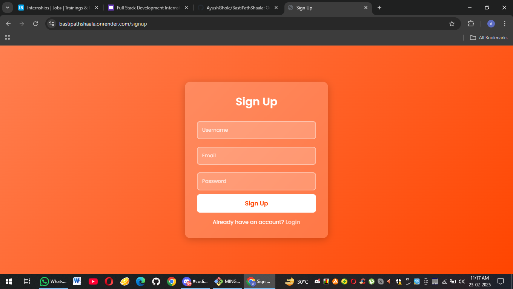

<b>🌍 NGO Donation Platform   </b>  
Our NGO Donation Platform is a secure and transparent system that allows users to donate funds for social causes. Donors can track their transactions, receive receipts, and support initiatives via multiple payment options. The platform ensures trust, accountability, and impact-driven contributions to help those in need. 💖✨

 

 
<h2>SetUp : </h2>
<h3>📌 1. Clone the Repository</h3>
<h3>📌 2. Install Dependencies</h3>
<h3>📌 3. Set Up Environment Variables</h3>
<h3>📌 4. Start MongoDB</h3>
<h3>📌 5. Run the Server</h3>
<h3>📌 6. Navigate the Platform</h3> 
1.) Register/Login as a user. 
2.) Donate via the donation page. 
3.) View Transactions in your dashboard. 
4.) Download Receipts for past donations. 

 

